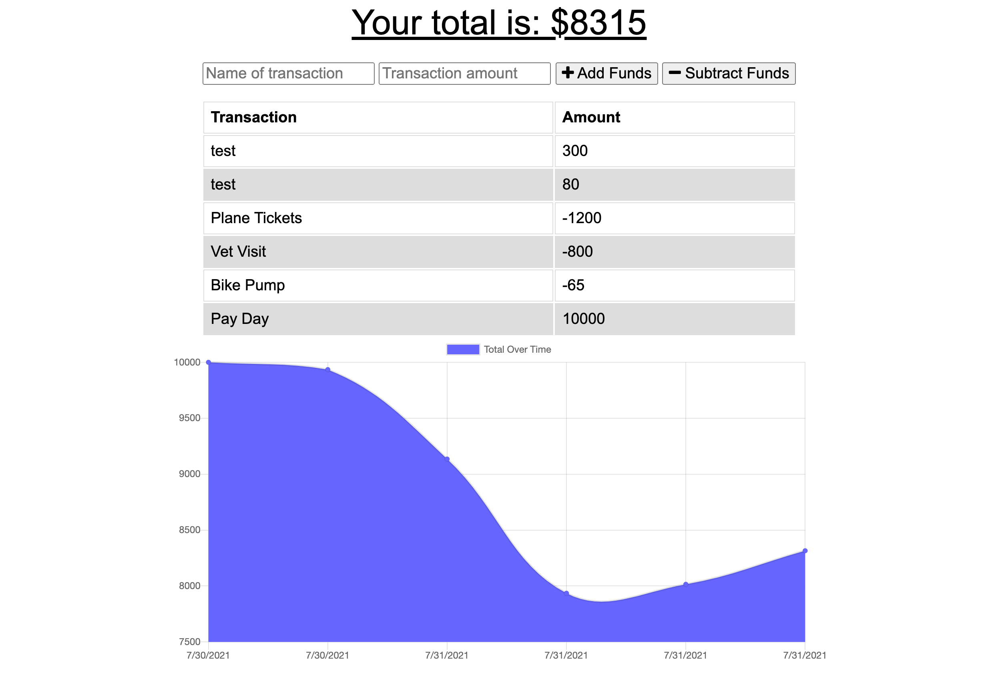

# Budget Tracker

## Summary: 
A budget tracking PWA that allows users to easily enter (and keep track of) their deposits and expenses, both online and offline. 

## Table of Contents
* [Installation](#installation)
* [Usage](#usage)
* [Screenshots](#screenshots)
* [Technologies](#technologies)
* [Questions](#questions)

## Installation:
To install the application clone the repository and run `npm i` in the command line to install dependencies.

## Usage:
* Use the deployed application here:
* You can download the PWA from your browser
### OR:
* Once repo is cloned locally, run `npm start` in the command line to start the application and go to `http://localhost:3001` to view the app in your browser.

## Screenshots:

## Technologies:
+ Express.js
+ Mongoose

## Questions:
GitHub: [crossigarcia](https://github.com/crossigarcia) 

For additional information on this project you can email your questions here: <cecilia.rossi.garcia@gmail.com>  